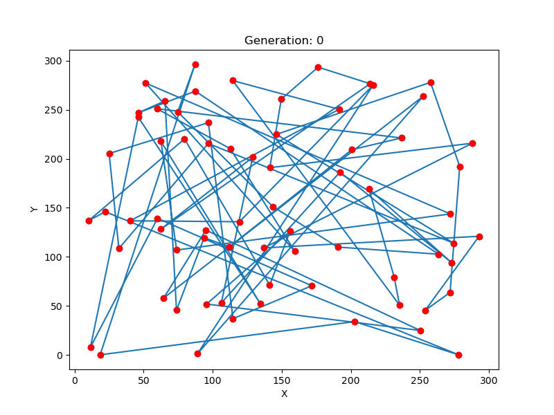
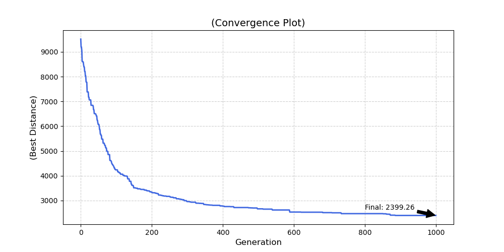

🚛 Traveling Salesperson Problem - Genetic Algorithm Solver
Implementation of genetic algorithm wchich is used to solve the TSP problem. Added visualization and path handling so 
project can be cloned.

🛠 Tech Stack 
- Language: Python

- Optimization: NumPy

- Visualization: Matplotlib, Seaborn

- Environment: Local env

📂 Project Structure
- src/ - Core logic of the genetic algorithm (initialization, selection, crossover, mutation, etc.)

- graphs/ - Output directory for generated GIF animations and convergence plots.

🚀 Quick Start
- git clone https://github.com/Gregir121/genetic_TSP.git
- pip install -r requirements.txt
- python src/main_code.py

📊 Results visualization
Below is the result of the evolution process for 70 cities, utilizing Inversion Mutation and Ordered Crossover (OX) to eliminate path crossings.

<em>Path optimization progress over generations</em>

<em>Convergence plot showing distance reduction</em>

